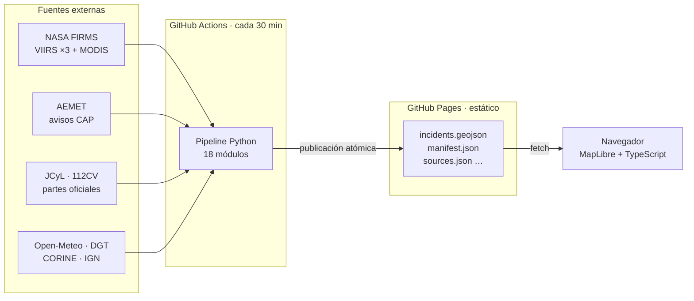
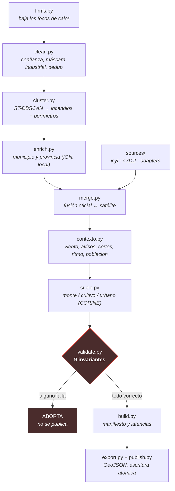
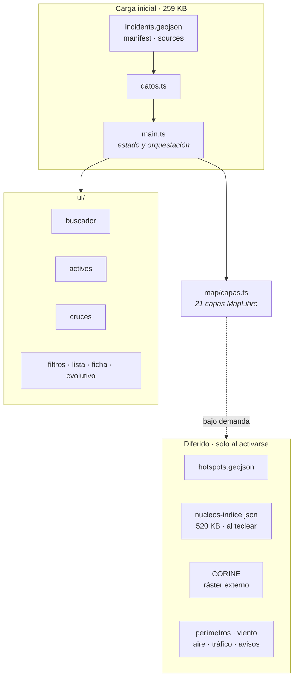
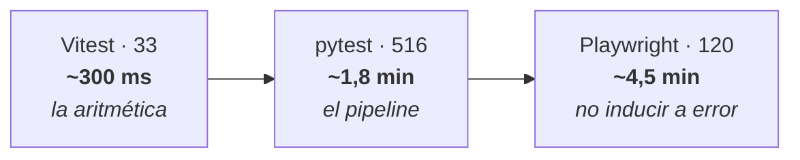
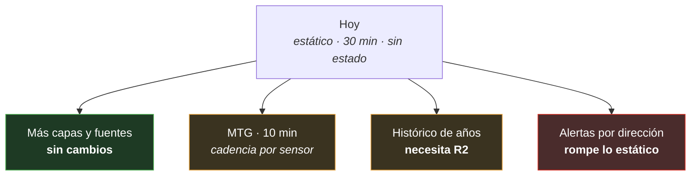

# Arquitectura

Cómo está montado esto, por qué, y qué hace falta para que crezca. Todas las
cifras están medidas contra el repositorio el **04-08-2026**, no estimadas.

Si buscas otra cosa: `ESPECIFICACION.md` es el contrato, `ESTADO-DEL-PROYECTO.md`
dice qué funciona hoy, `ERRORES-Y-SOLUCIONES.md` por qué está escrito así.

---

## 1 · La decisión que explica todo lo demás

**No hay servidor.** No hay base de datos, ni API, ni backend en ejecución.

Un cron de GitHub Actions ejecuta un pipeline de Python, escribe ficheros
estáticos, y GitHub Pages los sirve. El navegador los lee directamente.

**Por qué así.** Esto lo mira gente asustada durante un incendio, es decir: todo
el tráfico llega de golpe, justo cuando más caro sería caerse. Un CDN sirviendo
ficheros estáticos no se cae por una punta de visitas; una base de datos sí.
Además cuesta cero y no hay nada que administrar de madrugada.

**Qué nos cuesta.** No podemos personalizar por usuario en el servidor, ni
guardar nada suyo, ni responder consultas arbitrarias. Cada vez que una
funcionalidad ha necesitado algo de eso —«Mis activos»— la respuesta ha sido
resolverlo **en el navegador**, no añadir servidor.

---

## 2 · El pipeline

18 módulos, 4.226 líneas. El orden es el de ejecución y cada paso solo depende
del anterior.

| Módulo | Líneas | Qué hace |
|---|---:|---|
| `merge.py` | 435 | **El menos obvio del repo.** Fusiona parte oficial con detección |
| `contexto.py` | 427 | Cruza viento, avisos, cortes, ritmo y distancia a población |
| `pipeline.py` | 393 | Orquestación, `argparse`, logging |
| `aemet.py` | 331 | Avisos CAP 1.2 |
| `firms.py` | 276 | Ingesta NRT con reintentos |
| `health.py` | 264 | Estado por fuente: qué funciona, qué no y por qué |
| `validate.py` | 214 | Los 9 invariantes |
| resto | ~1.900 | `trafico`, `wind`, `suelo`, `aire`, `clean`, `cluster`, `enrich`, `export`, `build`, `publish`, `config` |

### Los 9 invariantes

Se comprueban **antes** de publicar. Si alguno falla, el pipeline aborta y no
sobrescribe: el visor sigue mostrando lo anterior con su edad real creciendo a
la vista, que es honesto. Publicar datos mal formados no lo sería.

| # | Invariante |
|---|---|
| 0 | Esquema completo según el contrato 4.3 |
| 1 | Sin `id` duplicados |
| 2 | Ningún incidente sin origen |
| 3 | `origin` coherente con los flags y dentro del vocabulario |
| 4 | Ventana temporal no invertida |
| 5 | Geometría dentro de España |
| 6 | Precisión positiva |
| 7 | Ningún incidente satelital sin focos que lo respalden |
| 8 | Ningún incendio extinguido publicado; `status` dentro del vocabulario |
| 9 | **Ningún estado afirmado sin parte oficial** |

El 9 es el que resume el proyecto entero: *nada se afirma sin quien lo afirme*.

---

## 3 · El frontend

Sin framework de componentes. TypeScript, MapLibre GL y CSS. Un mapa con
paneles no necesita React, y no tenerlo es lo que mantiene el paquete en
**239 KB comprimidos** de los 900 de presupuesto (RNF-02).

**La regla de carga:** lo que no se ve al abrir, no se descarga al abrir. El
índice de núcleos son 520 KB y solo se pide al primer tecleo; hay una prueba que
falla si alguien lo carga antes. Sin esa prueba, la regresión no la nota nadie
hasta que la carga inicial se ha doblado.

**Lo que nunca sale del navegador:** los activos que sube el usuario. Es un
argumento de venta, no solo higiene — y hay una prueba que falla si aparece
cualquier `POST`.

**Cinco mapas base**, y el defecto es «Sobrio» (CARTO, sin clave de API) por una
razón de lectura y no de gusto: sobre OSM estándar el naranja significa a la vez
carretera principal, línea de alta tensión e intensidad térmica alta, y con las
capas de infraestructura encendidas no se distinguía una línea de 400 kV de una
autovía. Con un fondo gris, el color queda para el dato. La regla que ordena la
paleta es **cálido = fuego, frío = todo lo demás**.

**En móvil el panel es un cajón.** Por debajo de 860 px sale de la izquierda con
su botón, velo y cierre por `Escape`. No es el caso secundario: quien busca
«incendio cerca de mi pueblo» lo hace desde el teléfono.

---

## 4 · Las pruebas

Tres capas, cada una para un tipo de fallo distinto. **669 pruebas.**

| Capa | Nº | Ficheros | Qué caza que las otras no |
|---|---:|---:|---|
| **Vitest** | 33 | 2 | Rumbos, distancias, lectura de CSV. El número plausible y equivocado |
| **pytest** | 516 | 23 | Fusión, invariantes, adaptadores, salud de fuentes. Cobertura ≥ 85 % (hoy **94,19 %**) |
| **Playwright** | 120 | 5 | Que la interfaz no engañe: latencias sin mezclar, aviso del 112, estado degradado |

**Por qué las tres.** El bug del punto (0, 0) —una coordenada vacía que se
colaba como el golfo de Guinea— **pasó los 107 escenarios de Playwright que había entonces sin
despeinarse**, porque a través de la interfaz solo se ve la etiqueta final, no
el ángulo que la produjo. Lo cazó Vitest en su primera ejecución.

Cada fuente externa tiene su fixture de regresión en `tests/fixtures/`. Cuando
un parseo falla en producción, el payload que lo rompió se convierte en fixture
**antes** de arreglar el código.

---

## 5 · Automatización

| Workflow | Disparo | Qué hace |
|---|---|---|
| `ci.yml` | push y PR | ruff · pytest · tsc · **vitest** · build · Playwright · presupuesto de peso |
| `ingest.yml` | cron + manual | Ingesta programada |
| `publicar.yml` | **cron `*/30`** | Pipeline completo y publicación |
| `sondear.yml` | manual | Sondeo de fuentes nuevas desde Actions, donde viven las claves |

Los secretos (`FIRMS_MAP_KEY`, `AEMET_API_KEY`) viven en GitHub Secrets. Nunca
en el repositorio ni en el chat.

---

## 6 · Escalabilidad

### Lo que aguanta sin tocar nada

**Tráfico.** Es el punto fuerte: un CDN estático absorbe una punta de visitas
durante un incendio grande sin hacer nada. No hay servidor que saturar.

**Capas nuevas.** El patrón está probado tres veces (CORINE, núcleos,
infraestructura): script de preparación → fichero estático → capa diferida.
Cada capa nueva cuesta un script y un conmutador, y **no toca el pipeline**.

**Fuentes autonómicas nuevas.** `sources/base.py` define el contrato; un
adaptador nuevo son ~150 líneas y su fixture. El `try` de `collect` garantiza
que una fuente rota no tumba el resto.

### Dónde está el techo, y qué haría falta

**Cadencia (verde/ámbar).** El cron va cada 30 min. MTG detecta cada 10, así que
publicar a 30 desperdicia el dato. La estructura ya lo soporta —cada fuente
declara su `max_data_age_seconds`— pero el cron de Actions no baja bien de 5
min. Salida: separar la publicación rápida de la lenta, o mover el disparo
fuera de Actions.

**Volumen histórico (ámbar).** Hoy la ventana son 3 días. Acumular años no cabe
en el repositorio ni en un GeoJSON. Necesita almacenamiento objeto —Cloudflare
R2— y Parquet particionado por fecha. **Es el mayor cambio arquitectónico
pendiente, y el que más valor comercial crea:** convierte un visor en un dataset
de riesgo, y eso no se copia rápido porque exige haber estado acumulando.

**Estado por usuario (rojo).** Alertas por correo necesitan servidor,
almacenamiento y RGPD. Es la única funcionalidad de la lista que **rompe** la
arquitectura, no que la estire. Merece su propia decisión, no colarla en un
bloque.

### Lo que NO haría

- **Base de datos en el camino de lectura.** Cambia el perfil de fallo del
  sistema entero por comodidad de consulta.
- **Framework de componentes.** Multiplicaría el paquete por un mapa con paneles.
- **Overpass o cualquier API comunitaria en vivo.** Se descarga una vez y se
  sirve estática. Meterla en el camino crítico es abusar de ella y quedarnos sin
  capa el día que nos limiten.

---

## 7 · Los tres principios

Explican casi todas las decisiones raras del código:

1. **Un fallo de fuente no tumba el pipeline**, pero **sí se publica que falló**.
2. **Nada se afirma sin quien lo afirme.** Sin parte oficial no hay estado.
3. **Ante la duda, no se muestra.** Un hueco explícito es honesto; un cero
   silencioso se lee como «hoy no arde nada», y ese es el fallo más peligroso
   que este sistema puede cometer.
